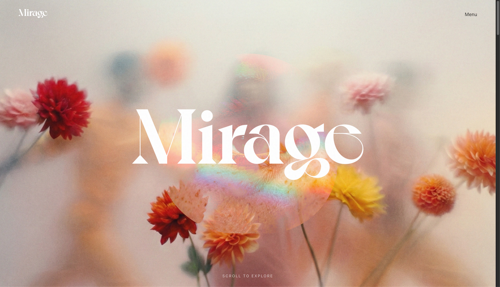
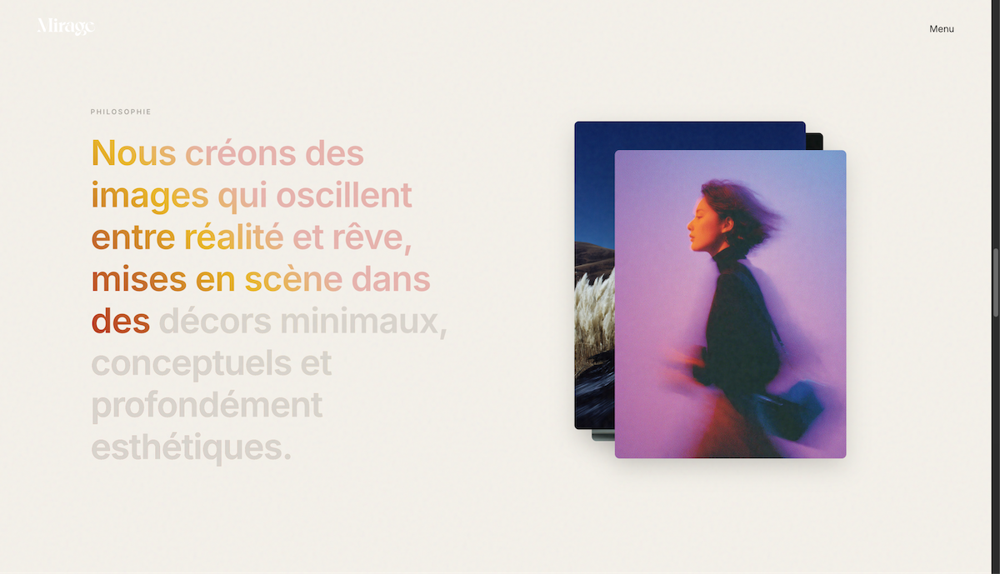
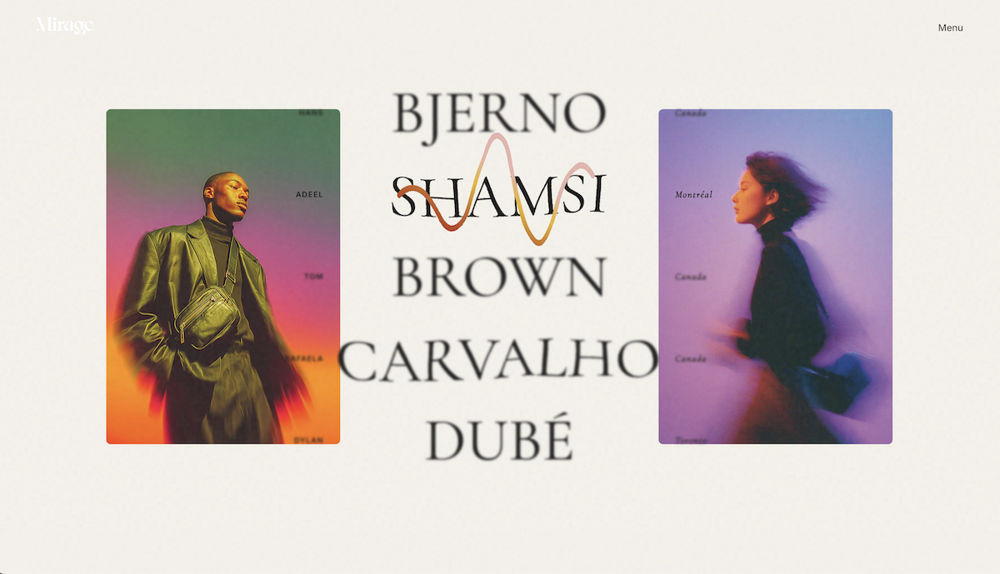

# MIRAGE — Studio Portfolio (Fictional) — WIP 🚧

Portfolio expérimental pour **MIRAGE**, un studio fictif hybride entre **photographie de mode**, **direction artistique** et **création visuelle surréaliste**.  
Objectif : prototyper une expérience web **minimaliste, arty et immersive**, avec une forte attention au **rythme**, à la **typographie**, à l'esthétique et à la mise en scène des projets.

👉 Preview : https://mirage-portfolio.vercel.app/

---

## Concept (ADN du studio)

**MIRAGE**  
> Une agence hybride entre photographie de mode, direction artistique et création visuelle surréaliste.  
> Nous créons des images qui oscillent entre réalité et rêve, mises en scène dans des décors minimaux, conceptuels et profondément esthétiques.

---

## Objectifs du projet

- Explorer un workflow de **prototypage rapide** (Antigravity) pour matérialiser une DA et une narration.
- Construire un **portfolio crédible** : positionnement, tonalité, structure UX, et “case studies” cohérentes.
- Tester une approche **motion-first** (GSAP) : micro-interactions, transitions, scroll animations.
- Constituer une base solide avant une future version **from scratch** (front-end) à mesure de la montée en compétences.

---

## Rôle

Projet personnel — **réalisé en autonomie** :
- Direction artistique (identité, ton, mood, composition)
- Structure UX / contenu (narration, hiérarchie, sections)
- Intégration / mise en page (Antigravity)
- Animations & micro-interactions (GSAP)
- Création des “cas clients” simulés (concepts + visuels)

---

## Stack & outils

- **Antigravity** (prototypage / site)
- **GSAP** (motion & micro-interactions)
- **Figma** (layout / UI / intentions)
- **Génération d’images** : Banana, Midjourney *(cas simulés — voir notes)*

---

## Statut

**Work in Progress (WIP)**  
- ✅ Home : structure principale + direction + premières animations
- ⏳ Section projets : listing (en cours de polishing)
- ⏳ Case studies : contenu & visuels en cours d’itération
- ⏳ Responsive final + optimisation perf + accessibilité

---

## Aperçu

*(Ajoute 2–4 screenshots dans `docs/` pour rendre le projet “portfolio-ready”)*

- `docs/hero.png`
- `docs/about.png`
- `docs/project-list.png`

Exemple :

---

## Case studies (simulés)

Le site présente **5 projets fictifs** afin de tester une narration “studio” réaliste :
- brief / intention créative
- parti-pris DA
- exécution & livrables (simulés)

> Les “cas clients” sont des scénarios de démonstration (pas des projets réels).

---

## Roadmap

### V1 — Prototype solide (en cours)
- Finaliser contenu (about, services, projets)
- Remplacer les placeholders par du texte définitif + assets cohérents
- Polishing motion (GSAP) : transitions, timings, easing, micro-interactions
- Responsive final (mobile / tablet / desktop)
- Accessibilité de base (contraste, navigation)

### V2 — Version “from scratch” (à venir)
- Rebuild en front-end (ex: Vue/Vite / ou React)
- Architecture composants + perf + optimisation
- Possibles modules immersifs (WebGL/Three.js) selon progression

---

## Notes & transparence (visuels)

Les visuels de certains projets sont **générés** (Banana / Midjourney) et **dirigés artistiquement** pour servir des **cas simulés** et un exercice de mise en scène.  
Aucune prétention de “projets clients réels”.

---

## Liens

- Preview : https://mirage-portfolio.vercel.app/

