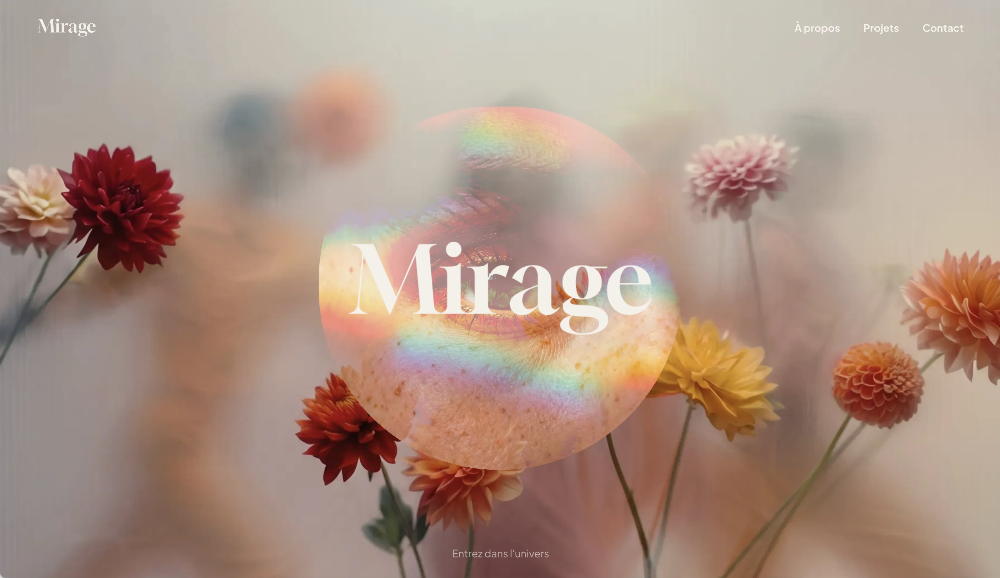
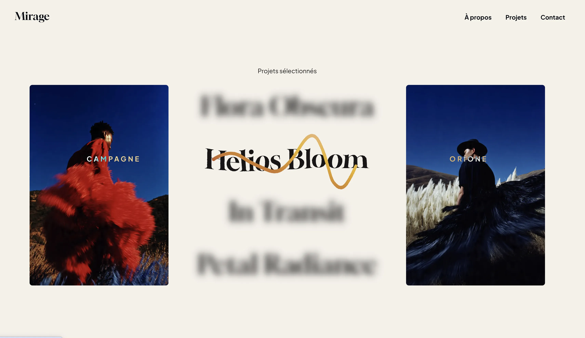
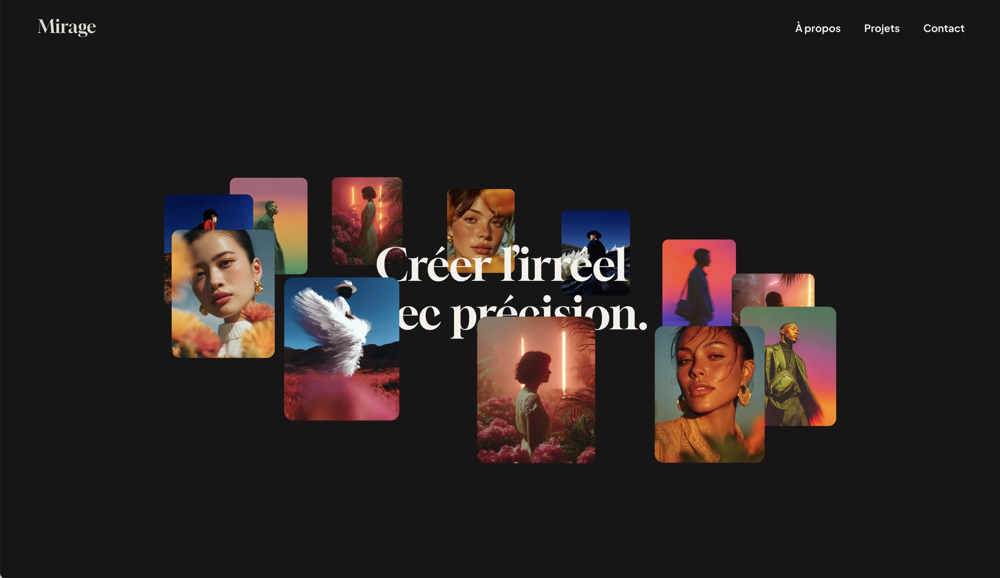
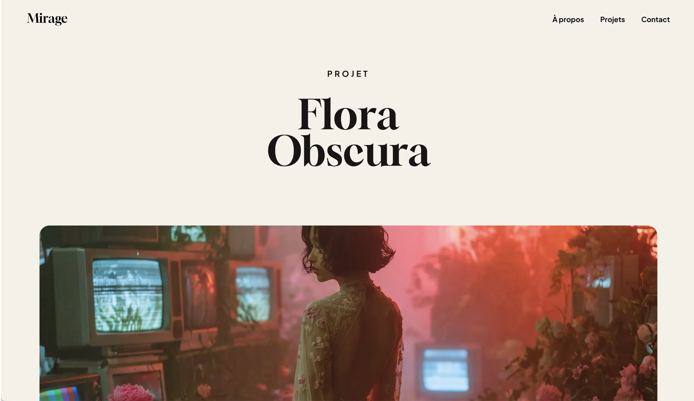

# Mirage Studio

A fictional creative studio website shaped through art direction, editorial composition, and motion-led interaction.

_Imaginer des mondes. Leur donner forme._

[View the live site](https://mirage-portfolio.vercel.app/)



## Overview

Mirage Studio is a fictional creative studio exploring image, space, light, material, and movement through a contemporary, fashion-oriented visual language.

The project brings art direction and creative front-end development together in a multi-page experience designed across Desktop, Tablet, and Mobile. Motion is treated as part of the composition itself, shaping rhythm, transitions, and the way content is discovered.

All studios, brands, and campaigns represented within Mirage are fictional and were created for the project.

## Home Experience



The Home page unfolds as a sequence of editorial compositions, connecting the Hero, Concept, Projects, Expertise, Clients, and closing sections through scroll-driven motion and section transitions.

Pinned sequences, project interactions, horizontal movement, and cover effects shape the desktop experience. On smaller viewports, layouts and interactions are reworked rather than simply scaled down.

## About



The About page is built as a distinct experience within the same visual system, moving through a spatial Hero, animated Approach cards, a Numbers sequence, and a typographic Manifesto.

Native WebGL drives the Numbers treatment, while SplitText is used to animate and redistribute the Manifesto typography.

## Project Pages



Four fictional project universes share the same page architecture and JavaScript runtime:

- Flora Obscura
- Helios Bloom
- In Transit
- Petal Radiance

Each page combines an animated Hero, editorial content, image galleries, art direction, testimonial, “Other Universes” navigation, and a shared Footer transition.

“Other Universes” adapts to input capabilities: GSAP Observer drives the desktop drag experience, while touch devices use native horizontal scrolling with inertia and scroll snapping.

## Motion & Interactions

GSAP and ScrollTrigger coordinate scrubbed sequences, pinned scenes, editorial reveals, and section transitions. Lenis provides smooth scrolling, while SplitText and GSAP Observer support typography and pointer-driven interactions.

Native WebGL and GLSL power the About Numbers treatment and the shared Footer deformation.

Page-to-page motion uses native cross-document View Transitions. Browsers without support fall back to standard navigation, while reduced-motion preferences disable the custom transition animation.

## Responsive Design

The main layout ranges are:

- **Desktop** — 1100px and above
- **Tablet** — 768px to 1099px
- **Mobile** — below 768px

Responsive behaviour is structural rather than purely proportional. Layouts become stacked where needed, typography and spacing adapt continuously, hover-only effects are removed on touch layouts, and native scrolling is used where it provides the better interaction.

Some interactions also adapt according to pointer capabilities rather than viewport size alone.

## Tech Stack

- Vite 5
- HTML
- CSS
- Vanilla JavaScript with ES modules
- GSAP
- ScrollTrigger
- SplitText
- GSAP Observer
- Lenis
- Native WebGL
- GLSL

Typography pairs Plus Jakarta Sans Variable, self-hosted through `@fontsource-variable`, with Gloock loaded from Google Fonts.

## Project Structure

```text
.
├── index.html
├── about.html
├── flora-obscura.html
├── helios-bloom.html
├── in-transit.html
├── petal-radiance.html
├── vite.config.js
├── vite-plugin-partials.js
├── src/
│   ├── main.js
│   ├── aboutMain.js
│   ├── projectPageMain.js
│   ├── home/
│   │   └── animations.js
│   ├── about/
│   │   ├── aboutHero.js
│   │   ├── aboutApproach.js
│   │   ├── aboutNumbers.js
│   │   ├── aboutManifesto.js
│   │   └── aboutFooter.js
│   ├── projects/
│   │   ├── projectHero.js
│   │   ├── projectTestimonial.js
│   │   ├── projectOtherUniverses.js
│   │   └── projectFooter.js
│   ├── webgl/
│   │   ├── footerWebGL.js
│   │   └── aboutNumbersWebGL.js
│   ├── partials/
│   ├── shaders/
│   └── styles/
└── public/
    └── assets/
```

## Getting Started

Install dependencies:

```sh
npm install
```

Start the development server:

```sh
npm run dev
```

Create a production build:

```sh
npm run build
```

Preview the production build:

```sh
npm run preview
```

## Notes

Mirage Studio is a fictional creative project. The studios, brands, campaigns, imagery, and visual assets presented throughout the experience were created and/or generated specifically for it.
